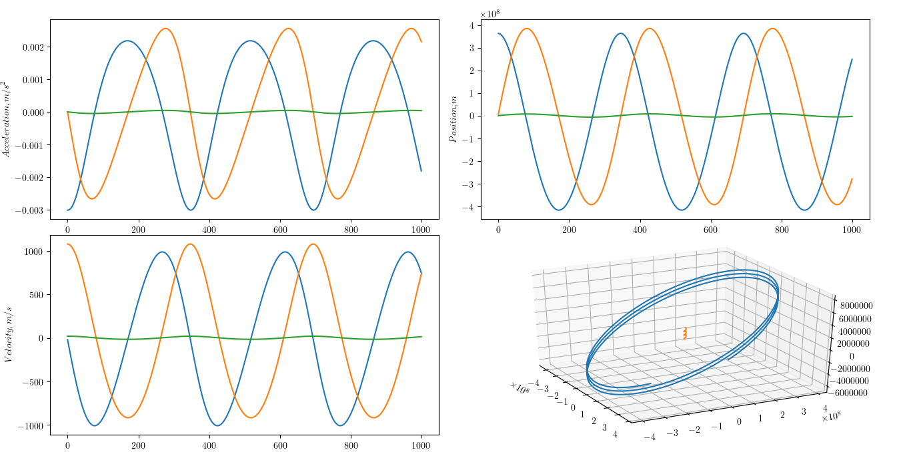

# Orbit calculator



```bash
$ python -m venv env
$ . env/bin/activate
$ pip install -r requirements.txt
$ python test_gravity.py # Testing
$ python main.py # Starting
$ deactivate # Exit environment
```